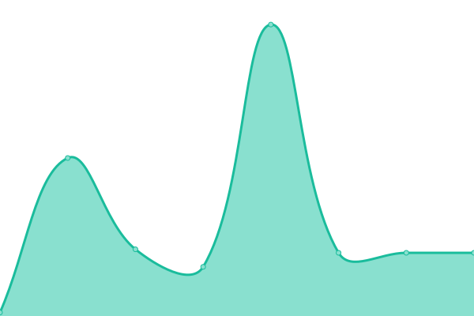

# [📈 Live Status](https://status.cmasnap.com): <!--live status--> **🟧 Partial outage**

This repository contains the open-source uptime monitor and status page for [CMAsnap](https://cmasnap.com), powered by [Upptime](https://github.com/upptime/upptime).

With [Upptime](https://upptime.js.org), you can get your own unlimited and free uptime monitor and status page, powered entirely by a GitHub repository. We use [Issues](https://github.com/CMAsnap/status/issues) as incident reports, [Actions](https://github.com/CMAsnap/status/actions) as uptime monitors, and [Pages](https://status.cmasnap.com) for the status page.

<!--start: status pages-->
<!-- This summary is generated by Upptime (https://github.com/upptime/upptime) -->
<!-- Do not edit this manually, your changes will be overwritten -->
<!-- prettier-ignore -->
| URL | Status | History | Response Time | Uptime |
| --- | ------ | ------- | ------------- | ------ |
|  [Website](https://www.cmasnap.com/) | 🟩 Up | [website.yml](https://github.com/CMAsnap/status/commits/HEAD/history/website.yml) | 

 333ms
     
 | 

<a href="https://status.cmasnap.com/history/website">100.00%</a>
    

|  [CMAsnap](https://app.cmasnap.com/api/ping/) | 🟩 Up | [cm-asnap.yml](https://github.com/CMAsnap/status/commits/HEAD/history/cm-asnap.yml) | 

 136ms
     
 | 

<a href="https://status.cmasnap.com/history/cm-asnap">100.00%</a>
    

|  [Beta](https://beta.cmasnap.com/api/ping/) | 🟩 Up | [beta.yml](https://github.com/CMAsnap/status/commits/HEAD/history/beta.yml) | 

 142ms
     
 | 

<a href="https://status.cmasnap.com/history/beta">100.00%</a>
    

|  [Staging](https://staging.cmasnap.com/api/ping/) | 🟩 Up | [staging.yml](https://github.com/CMAsnap/status/commits/HEAD/history/staging.yml) | 

 141ms
     
 | 

<a href="https://status.cmasnap.com/history/staging">100.00%</a>
    

|  [Development](https://development.cmasnap.com/api/ping/) | 🟩 Up | [development.yml](https://github.com/CMAsnap/status/commits/HEAD/history/development.yml) | 

 139ms
     
 | 

<a href="https://status.cmasnap.com/history/development">100.00%</a>
    

|  [Reports](https://reports.cmasnap.com/api/health) | 🟩 Up | [reports.yml](https://github.com/CMAsnap/status/commits/HEAD/history/reports.yml) | 

 149ms
     
 | 

<a href="https://status.cmasnap.com/history/reports">100.00%</a>
    

|  [Geocoding](http://159.223.144.242:4000/status) | 🟩 Up | [geocoding.yml](https://github.com/CMAsnap/status/commits/HEAD/history/geocoding.yml) | 

 64ms
     
 | 

<a href="https://status.cmasnap.com/history/geocoding">100.00%</a>
    

|  Print | 🟩 Up | [print.yml](https://github.com/CMAsnap/status/commits/HEAD/history/print.yml) | 

 5066ms
     
 | 

<a href="https://status.cmasnap.com/history/print">100.00%</a>
    

|  [Feedback](https://feedback.cmasnap.com/_health/) | 🟩 Up | [feedback.yml](https://github.com/CMAsnap/status/commits/HEAD/history/feedback.yml) | 

 162ms
     
 | 

<a href="https://status.cmasnap.com/history/feedback">100.00%</a>
    

|  [ACTRIS (Beta)](https://beta.cmasnap.com/api/listings?datasetId=actris) | 🟥 Down | [actris-beta.yml](https://github.com/CMAsnap/status/commits/HEAD/history/actris-beta.yml) | 

 1270ms
     
 | 

<a href="https://status.cmasnap.com/history/actris-beta">1.11%</a>
    

|  [HAR (Beta)](https://beta.cmasnap.com/api/listings?datasetId=har) | 🟥 Down | [har-beta.yml](https://github.com/CMAsnap/status/commits/HEAD/history/har-beta.yml) | 

 2450ms
     
 | 

<a href="https://status.cmasnap.com/history/har-beta">2.94%</a>
    

|  [CTXMLS (Beta)](https://beta.cmasnap.com/api/listings?datasetId=ctxmls) | 🟥 Down | [ctxmls-beta.yml](https://github.com/CMAsnap/status/commits/HEAD/history/ctxmls-beta.yml) | 

 784ms
     
 | 

<a href="https://status.cmasnap.com/history/ctxmls-beta">2.00%</a>
    

|  [SABOR (Beta)](https://beta.cmasnap.com/api/listings?datasetId=sabor) | 🟥 Down | [sabor-beta.yml](https://github.com/CMAsnap/status/commits/HEAD/history/sabor-beta.yml) | 

 180ms
     
 | 

<a href="https://status.cmasnap.com/history/sabor-beta">0.25%</a>
    

<!--end: status pages-->

[**Visit our status website →**](https://status.cmasnap.com)

## 📄 License

- Powered by: [Upptime](https://github.com/upptime/upptime)
- Code: [MIT](./LICENSE) © [CMAsnap](https://cmasnap.com)
- Data in the `./history` directory: [Open Database License](https://opendatacommons.org/licenses/odbl/1-0/)
