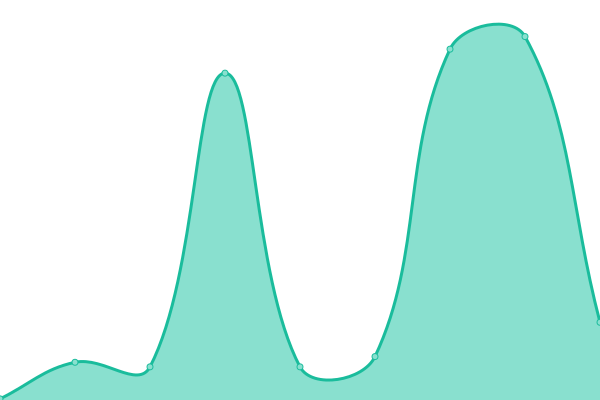

# [📈 Live Status](https://status.cmasnap.com): <!--live status--> **🟧 Partial outage**

This repository contains the open-source uptime monitor and status page for [CMAsnap](https://cmasnap.com), powered by [Upptime](https://github.com/upptime/upptime).

With [Upptime](https://upptime.js.org), you can get your own unlimited and free uptime monitor and status page, powered entirely by a GitHub repository. We use [Issues](https://github.com/CMAsnap/status/issues) as incident reports, [Actions](https://github.com/CMAsnap/status/actions) as uptime monitors, and [Pages](https://status.cmasnap.com) for the status page.

<!--start: status pages-->
<!-- This summary is generated by Upptime (https://github.com/upptime/upptime) -->
<!-- Do not edit this manually, your changes will be overwritten -->
<!-- prettier-ignore -->
| URL | Status | History | Response Time | Uptime |
| --- | ------ | ------- | ------------- | ------ |
|  [CMAsnap (Beta)](https://beta.cmasnap.com/api/ping/) | 🟩 Up | [cm-asnap-beta.yml](https://github.com/CMAsnap/status/commits/HEAD/history/cm-asnap-beta.yml) | 

 250ms
     
 | 

<a href="https://status.cmasnap.com/history/cm-asnap-beta">100.00%</a>
    

|  [CMAsnap (Staging)](https://cmasnap-staging.herokuapp.com/api/ping/) | 🟩 Up | [cm-asnap-staging.yml](https://github.com/CMAsnap/status/commits/HEAD/history/cm-asnap-staging.yml) | 

 305ms
     
 | 

<a href="https://status.cmasnap.com/history/cm-asnap-staging">100.00%</a>
    

|  [CMAsnap (Development)](https://cmasnap-development.herokuapp.com/api/ping/) | 🟩 Up | [cm-asnap-development.yml](https://github.com/CMAsnap/status/commits/HEAD/history/cm-asnap-development.yml) | 

 299ms
     
 | 

<a href="https://status.cmasnap.com/history/cm-asnap-development">100.00%</a>
    

|  CMAsnap Print | 🟥 Down | [cm-asnap-print.yml](https://github.com/CMAsnap/status/commits/HEAD/history/cm-asnap-print.yml) | 

 291ms
     
 | 

<a href="https://status.cmasnap.com/history/cm-asnap-print">14.60%</a>
    

<!--end: status pages-->

[**Visit our status website →**](https://status.cmasnap.com)

## 📄 License

- Powered by: [Upptime](https://github.com/upptime/upptime)
- Code: [MIT](./LICENSE) © [CMAsnap](https://cmasnap.com)
- Data in the `./history` directory: [Open Database License](https://opendatacommons.org/licenses/odbl/1-0/)
