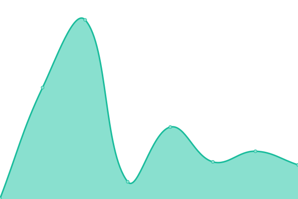
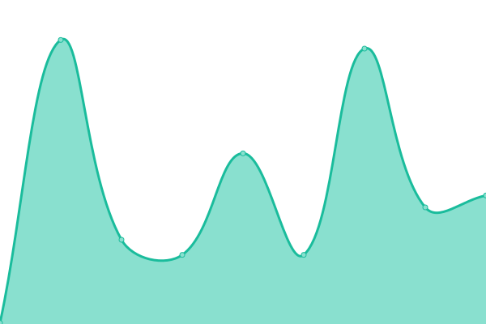

# [📈 Live Status](https://status.cmasnap.com): <!--live status--> **🟩 All systems operational**

This repository contains the open-source uptime monitor and status page for [CMAsnap](https://cmasnap.com), powered by [Upptime](https://github.com/upptime/upptime).

With [Upptime](https://upptime.js.org), you can get your own unlimited and free uptime monitor and status page, powered entirely by a GitHub repository. We use [Issues](https://github.com/CMAsnap/status/issues) as incident reports, [Actions](https://github.com/CMAsnap/status/actions) as uptime monitors, and [Pages](https://status.cmasnap.com) for the status page.

<!--start: status pages-->
<!-- This summary is generated by Upptime (https://github.com/upptime/upptime) -->
<!-- Do not edit this manually, your changes will be overwritten -->
<!-- prettier-ignore -->
| URL | Status | History | Response Time | Uptime |
| --- | ------ | ------- | ------------- | ------ |
|  [CMAsnap](https://app.cmasnap.com/api/ping/) | 🟩 Up | [cm-asnap.yml](https://github.com/CMAsnap/status/commits/HEAD/history/cm-asnap.yml) | 

 330ms
     
 | 

<a href="https://status.cmasnap.com/history/cm-asnap">99.53%</a>
    

|  [Beta](https://beta.cmasnap.com/api/ping/) | 🟩 Up | [beta.yml](https://github.com/CMAsnap/status/commits/HEAD/history/beta.yml) | 

 261ms
     
 | 

<a href="https://status.cmasnap.com/history/beta">100.00%</a>
    

|  [Development](https://development.cmasnap.com/api/ping/) | 🟩 Up | [development.yml](https://github.com/CMAsnap/status/commits/HEAD/history/development.yml) | 

 315ms
     
 | 

<a href="https://status.cmasnap.com/history/development">100.00%</a>
    

|  [Website](https://cmasnap.com/) | 🟩 Up | [website.yml](https://github.com/CMAsnap/status/commits/HEAD/history/website.yml) | 

 510ms
     
 | 

<a href="https://status.cmasnap.com/history/website">99.75%</a>
    

|  [Reports](https://reports.cmasnap.com/api/health) | 🟩 Up | [reports.yml](https://github.com/CMAsnap/status/commits/HEAD/history/reports.yml) | 

 326ms
     
 | 

<a href="https://status.cmasnap.com/history/reports">100.00%</a>
    

|  Print | 🟩 Up | [print.yml](https://github.com/CMAsnap/status/commits/HEAD/history/print.yml) | 

 10908ms
     
 | 

<a href="https://status.cmasnap.com/history/print">99.18%</a>
    

|  [ACTRIS](https://app.cmasnap.com/api/listings?datasetId=actris) | 🟩 Up | [actris.yml](https://github.com/CMAsnap/status/commits/HEAD/history/actris.yml) | 

 242ms
     
 | 

<a href="https://status.cmasnap.com/history/actris">98.71%</a>
    

|  [HAR](https://app.cmasnap.com/api/listings?datasetId=har) | 🟩 Up | [har.yml](https://github.com/CMAsnap/status/commits/HEAD/history/har.yml) | 

 163ms
     
 | 

<a href="https://status.cmasnap.com/history/har">98.73%</a>
    

|  [CTXMLS](https://app.cmasnap.com/api/listings?datasetId=ctxmls) | 🟩 Up | [ctxmls.yml](https://github.com/CMAsnap/status/commits/HEAD/history/ctxmls.yml) | 

 342ms
     
 | 

<a href="https://status.cmasnap.com/history/ctxmls">98.74%</a>
    

|  [SABOR](https://app.cmasnap.com/api/listings?datasetId=sabor) | 🟩 Up | [sabor.yml](https://github.com/CMAsnap/status/commits/HEAD/history/sabor.yml) | 

 376ms
     
 | 

<a href="https://status.cmasnap.com/history/sabor">98.76%</a>
    

|  [NWMLS](https://app.cmasnap.com/api/listings?datasetId=nwmls) | 🟩 Up | [nwmls.yml](https://github.com/CMAsnap/status/commits/HEAD/history/nwmls.yml) | 

 121ms
     
 | 

<a href="https://status.cmasnap.com/history/nwmls">98.77%</a>
    

|  [DOORIFY](https://app.cmasnap.com/api/listings?datasetId=doorify) | 🟩 Up | [doorify.yml](https://github.com/CMAsnap/status/commits/HEAD/history/doorify.yml) | 

 157ms
     
 | 

<a href="https://status.cmasnap.com/history/doorify">98.79%</a>
    

|  [NTREIS](https://app.cmasnap.com/api/listings?datasetId=ntreis) | 🟩 Up | [ntreis.yml](https://github.com/CMAsnap/status/commits/HEAD/history/ntreis.yml) | 

 808ms
     
 | 

<a href="https://status.cmasnap.com/history/ntreis">98.81%</a>
    

|  [CCIMLS](https://app.cmasnap.com/api/listings?datasetId=ccimls) | 🟩 Up | [ccimls.yml](https://github.com/CMAsnap/status/commits/HEAD/history/ccimls.yml) | 

 1174ms
     
 | 

<a href="https://status.cmasnap.com/history/ccimls">98.82%</a>
    

|  [REALMLS](https://app.cmasnap.com/api/listings?datasetId=realmls) | 🟩 Up | [realmls.yml](https://github.com/CMAsnap/status/commits/HEAD/history/realmls.yml) | 

 129ms
     
 | 

<a href="https://status.cmasnap.com/history/realmls">98.84%</a>
    

<!--end: status pages-->

[**Visit our status website →**](https://status.cmasnap.com)

## 📄 License

- Powered by: [Upptime](https://github.com/upptime/upptime)
- Code: [MIT](./LICENSE) © [CMAsnap](https://cmasnap.com)
- Data in the `./history` directory: [Open Database License](https://opendatacommons.org/licenses/odbl/1-0/)
